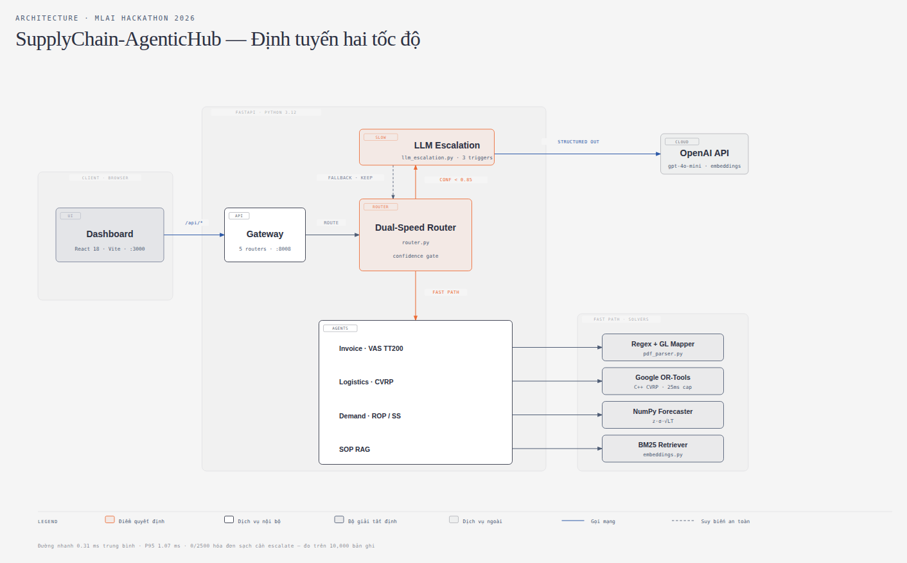

# 🚀 SupplyChain-AgenticHub

> **Nền tảng đa tác thể tự động hóa 4 quy trình vận hành doanh nghiệp, với ràng buộc độ trễ dưới 200ms.**
> MLAI Hackathon 2026 — Lĩnh vực 5: Tối Ưu Hóa Vận Hành.

**Tuyên bố cốt lõi:** Bốn quy trình doanh nghiệp — hạch toán hóa đơn, định tuyến
giao hàng, dự báo tồn kho, tra cứu quy chế — được xử lý bằng **đường nhanh tất
định** (regex, OR-Tools C++, NumPy, BM25) ở mức **0.31 ms trung bình**. LLM chỉ
được gọi ở **đường chậm**, khi đường nhanh tự nhận ra mình không đủ tin cậy.

| Chỉ số (đo trên 10,000 bản ghi) | Giá trị |
| :--- | :---: |
| Độ trễ trung bình / P95 | **0.31 ms** / **1.07 ms** |
| Accuracy in-distribution | 100.00% |
| **Accuracy trên dữ liệu chưa từng gặp** | **25.00%** ← xem [§6](#6-giới-hạn-đã-đo-của-hệ-thống) |
| Hóa đơn sạch cần gọi LLM | **0 / 2,500** |
| Test | **42 passed, 2 skipped** |

```bash
make dev      # cài mọi thứ còn thiếu rồi khởi động — chạy được trên clone sạch
```

---

## 1. Sơ đồ kiến trúc



> Bản gốc SVG (phóng to không vỡ): [`docs/architecture.html`](docs/architecture.html)
> Sơ đồ **phản ánh đúng mã nguồn thực tế** — mỗi hộp đều ghi tên file tương ứng ở §3.

**Đọc sơ đồ trong 20 giây:**

1. `Dashboard` (React) gọi `Gateway` (FastAPI) qua `/api/*`.
2. `Gateway` chuyển cho **`Dual-Speed Router`** — điểm quyết định của toàn hệ thống.
3. **Mặc định: đường nhanh** (mũi tên cam đi xuống) → 4 agent → 4 bộ giải tất định.
4. **Ngoại lệ: đường chậm** (mũi tên cam đi lên) → `LLM Escalation` → OpenAI.
   Chỉ kích hoạt khi `confidence < 0.85`, lệch số học, hoặc thiếu mã số thuế.
5. **Nếu OpenAI không khả dụng** (mũi tên đứt) → giữ nguyên kết quả đường nhanh,
   ghi trạng thái `UNAVAILABLE`/`FAILED`, **không bao giờ ném lỗi**.

---

## 2. Tại sao chọn công nghệ này

Mỗi lựa chọn dưới đây phục vụ một ràng buộc cụ thể, không phải vì thời thượng.

| Công nghệ | Dùng ở đâu | Vì sao chọn |
| :--- | :--- | :--- |
| **Google OR-Tools** | `vrp_solver.py` | CVRP là bài toán **NP-hard**. Prompt LLM không cho lời giải *khả thi* (đúng tải trọng, mỗi điểm đúng 1 lần). OR-Tools là solver C++ cho lời giải kiểm chứng được trong **~1.0 ms**, giới hạn cứng 25 ms. |
| **Regex + luật VAS** | `pdf_parser.py` | Hóa đơn GTGT Việt Nam có cấu trúc cố định. Bóc tách số tiền bằng regex là **tất định và đối soát được**; dùng LLM cho việc này vừa chậm hơn hàng nghìn lần vừa có rủi ro sai số học. |
| **NumPy** | `forecaster.py` | Tồn kho an toàn có **công thức đóng** `z·σ·√LT`. Không cần học máy; công thức tính lại được và giải thích được trước kiểm toán. |
| **BM25 (tự cài)** | `embeddings.py` | Kho SOP chỉ 4 tài liệu. BM25 có IDF + chuẩn hóa độ dài chạy **~0.07 ms offline**; kéo cả vector DB vào là thừa ở quy mô này (xem [§6.2](#62-bm25-gần-như-đã-đủ-cho-kho-4-tài-liệu)). |
| **OpenAI Structured Outputs** | `llm_escalation.py` | Chỉ dùng ở **đường chậm**. `chat.completions.parse` + Pydantic schema **ràng buộc** đầu ra vào đúng 1 trong 4 tài khoản VAS — không parse chuỗi tự do, không chỗ cho ảo giác. |
| **OpenAI Embeddings** | `embeddings.py` | Chỉ khi câu hỏi diễn đạt lại không giao từ vựng với tài liệu — trường hợp BM25 **đã đo được là thua**. |
| **FastAPI + Pydantic v2** | `main.py`, `api/` | Validate schema ở biên, tự sinh Swagger cho giám khảo test trực tiếp. |
| **Python 3.12** | toàn bộ backend | Bắt buộc: `ortools` **chưa có wheel cho Python 3.14**. |
| **React + Vite** | `frontend/` | Dev server proxy `/api` sang backend, HMR nhanh khi demo trực tiếp. |

**Nguyên tắc xuyên suốt:** *Bài toán nào có lời giải toán học tất định thì dùng
toán học. LLM chỉ xử lý phần mơ hồ ngữ nghĩa mà luật cứng không bao được.*

---

## 3. Cấu trúc thư mục

Đối chiếu trực tiếp với sơ đồ §1 — cột chú thích ghi vai trò trong kiến trúc.

```
NCKH/
├── Makefile                      # make dev / test / bench / doctor
├── run_demo.sh                   # launcher: preflight → khởi động → verify proxy
│
├── backend/
│   ├── requirements.txt
│   └── app/
│       ├── main.py               # FastAPI app, CORS, gắn 5 router, /health
│       ├── config.py             # CONFIDENCE_THRESHOLD=0.85, cổng, API key
│       │
│       ├── agents/               # ── Tầng điều phối & nghiệp vụ ──
│       │   ├── router.py         # ★ Dual-Speed Router — điểm quyết định
│       │   ├── llm_escalation.py # ★ Đường chậm: Structured Outputs, 3 trigger
│       │   ├── invoice_agent.py  #   Hóa đơn + hạch toán VAS/TT200
│       │   ├── logistics_agent.py#   Định tuyến (hệ số thời tiết/kẹt xe)
│       │   ├── demand_agent.py   #   Dự báo nhu cầu + khuyến nghị PO
│       │   └── rag_agent.py      #   Tra cứu SOP + ngưỡng từ chối
│       │
│       ├── solvers/              # ── Bộ giải tất định (đường nhanh) ──
│       │   ├── pdf_parser.py     #   Regex bóc tách + ánh xạ tài khoản GL
│       │   ├── vrp_solver.py     #   Google OR-Tools CVRP (C++)
│       │   ├── forecaster.py     #   NumPy: xu hướng, mùa vụ, ROP, safety stock
│       │   └── embeddings.py     #   BM25 + OpenAI embeddings (cosine)
│       │
│       ├── api/                  # ── 5 route, mỗi domain một file ──
│       │   ├── routes_invoice.py     # POST /api/invoice/process
│       │   ├── routes_logistics.py   # POST /api/logistics/solve
│       │   ├── routes_demand.py      # POST /api/demand/forecast
│       │   ├── routes_rag.py         # POST /api/rag/query
│       │   └── routes_benchmark.py   # GET  /api/benchmark/run?samples=N
│       │
│       ├── benchmark/            # ── Đo lường ──
│       │   ├── evaluator.py      # ★ Tiêu chí chấm đúng từng domain + macro-F1
│       │   ├── generator.py      #   Sinh dữ liệu benchmark
│       │   └── report.py         #   Tái lập toàn bộ số liệu bằng 1 lệnh
│       │
│       ├── memory/agent_memory.py    # Ghi log quyết định (AgentDB)
│       │
│       └── tests/                # 44 test — xem §7
│           ├── test_generalization.py   # ★ Khóa con số held-out 25%
│           ├── test_rag_retrieval.py    # ★ Khóa chất lượng truy xuất SOP
│           ├── test_llm_escalation.py   # ★ Trigger + 2 đường suy biến
│           ├── test_benchmark.py        #   F1 phải được tính, không phải hằng số
│           └── test_{invoice,demand,vrp_logistics,rag,router,api_routes,health}.py
│
├── frontend/src/
│   ├── services/api.ts           # Kiểu TypeScript khớp schema Pydantic
│   └── components/
│       ├── InvoiceStudio.tsx     # ★ Badge FAST-PATH / LLM SLOW-PATH
│       ├── RAGAssistant.tsx      # ★ Badge BM25 / SEMANTIC + điểm truy xuất
│       ├── VRPMap.tsx            #   Bản đồ Leaflet, lộ trình theo thời tiết
│       ├── DemandForecaster.tsx  #   Biểu đồ Recharts + ROP
│       ├── BenchmarkHub.tsx      #   Chạy benchmark trực tiếp, xuất bảng LaTeX
│       ├── CommandCenter.tsx     #   Tổng quan
│       └── Navbar.tsx
│
├── data/
│   └── operations_benchmark_v2.json  # 10,000 bản ghi (tự sinh — xem §6.1)
│
└── docs/
    ├── architecture.html         # Sơ đồ kiến trúc (bản gốc)
    ├── DEMO_DAY.md               # Kịch bản demo, Q&A, phương án dự phòng
    └── paper_outline.md          # Đề cương bài báo khoa học
```

★ = file thể hiện tuyên bố cốt lõi, nên đọc trước.

---

## 4. Cài đặt & chạy

```bash
make dev
```

Tự cài venv Python 3.12, thư viện backend, `node_modules` rồi khởi động cả hai
server. Lần chạy sau bỏ qua bước cài.

- **Dashboard:** http://localhost:3000
- **Swagger (giám khảo test trực tiếp):** http://localhost:8008/docs
- **Benchmark:** http://localhost:8008/api/benchmark/run?samples=1000

Cổng bận → `make dev FRONTEND_PORT=3100`

| Lệnh | Việc |
| :--- | :--- |
| `make dev` | Cài (nếu thiếu) rồi khởi động |
| `make check` | Preflight: kiểm tra deps + cổng, không khởi động |
| `make doctor` | Báo cáo môi trường: uv, pnpm, venv, API key, cổng |
| `make test` | 42 passed, 2 skipped |
| `make bench` | Tái lập toàn bộ số liệu §5–§6 |
| `make build` / `make lint` | Build bundle / type-check |
| `make clean-all` | Xóa venv + node_modules |

**Yêu cầu:** [uv](https://docs.astral.sh/uv/) (tự tải Python 3.12, không cần
sudo) và `pnpm`. `ortools` **chưa có wheel cho Python 3.14**.

```bash
# (Tùy chọn) Bật đường chậm — thiếu key hệ thống vẫn chạy đầy đủ
echo 'OPENAI_API_KEY=sk-...' > .env
```

---

## 5. Kết quả đo

Tái lập bằng một lệnh: `make bench`

### 5.1 In-distribution — 10,000 bản ghi

| Domain | N | Mean | P95 | Acc | Macro-F1 | Tiêu chí chấm đúng |
| :--- | :---: | :---: | :---: | :---: | :---: | :--- |
| Invoice | 2,500 | 0.033 ms | 0.040 ms | 100.00% | 1.0000 | Đúng TK Nợ **và** tổng tiền khớp nhãn |
| Logistics | 2,500 | 1.023 ms | 1.180 ms | 100.00% | — | Lời giải **khả thi**: mọi điểm đúng 1 lần, không vượt tải |
| Demand | 2,500 | 0.179 ms | 0.220 ms | 100.00% | — | SS & ROP khớp công thức tính lại độc lập (sai số < 0.5) |
| SOP RAG | 2,500 | 0.010 ms | 0.010 ms | 100.00% | 1.0000 | Trích dẫn đầu tiên đúng mã SOP |
| **Toàn hệ thống** | **10,000** | **0.311 ms** | **1.070 ms** | **100.00%** | **1.0000** | |

> Macro-F1 chỉ báo cáo cho 2 domain có nhãn phân loại. Logistics và Demand chấm
> bằng *kiểm định khả thi* và *tính lại công thức* — F1 theo lớp không có nghĩa
> ở đó, nên để trống thay vì điền số giả.

### 5.2 Đường chậm (LLM Escalation)

| Điều kiện kích hoạt | Ý nghĩa nghiệp vụ |
| :--- | :--- |
| `LOW_CONFIDENCE` | Regex không chắc chắn (`confidence < 0.85`) |
| `MATH_MISMATCH` | Tiền hàng + thuế ≠ tổng thanh toán |
| `UNKNOWN_VENDOR` | Không đọc được mã số thuế |

Đo được: **0/2,500** hóa đơn sạch cần escalate (nên đường nhanh giữ nguyên
0.31 ms), **8/8** hóa đơn lộn xộn thì có.

---

## 6. Giới hạn đã đo của hệ thống

*Phần này công bố những gì hệ thống chưa làm được. Một hệ thống biết rõ giới hạn
của mình đáng tin hơn một hệ thống chỉ báo cáo số đẹp.*

### 6.1 Con số 100% là in-distribution, không phải khả năng tổng quát

Bộ dữ liệu benchmark **tự sinh từ 6 mẫu nhà cung cấp** — không phải dữ liệu
doanh nghiệp thật. Trên hóa đơn có mặt hàng chưa từng xuất hiện:

| Bộ đo | Accuracy phân loại tài khoản |
| :--- | :---: |
| In-distribution (10,000 bản ghi) | **100.00%** |
| **Held-out (mặt hàng mới)** | **25.00%** |
| Baseline "luôn đoán TK 152" | 25.00% |

Luật regex **không có kỹ năng thật** nào ngoài đoán lớp đa số. Đây chính là
**lý do định lượng** để xây đường chậm, chứ không phải để "cho có OpenAI".
Con số được khóa trong `test_generalization.py` để không âm thầm trôi.

### 6.2 BM25 gần như đã đủ cho kho 4 tài liệu

| Bộ đo | BM25 | Ghi chú |
| :--- | :---: | :--- |
| Câu diễn đạt lại — dễ (10 câu) | **10/10** | Có giao từ vựng với tài liệu |
| **Câu diễn đạt lại — khó (6 câu)** | **4/6** | Gần như không giao từ vựng |
| Câu ngoài phạm vi (3 câu) | từ chối đúng 3/3 | |

Embeddings chỉ thực sự cần cho **2/6 câu khó**. Với 4 tài liệu, đây là kết quả
hợp lý — giá trị của embeddings tăng theo quy mô kho tài liệu.

### 6.3 Hai lỗi đã tự phát hiện và sửa

1. **Nhãn trường bị hiểu nhầm thành từ khóa.** `"Hàng hóa:"` có trong *mọi* hóa
   đơn GTGT, nhưng bộ phân loại khớp nó trên toàn văn bản → nhánh TK 156 luôn
   bắn trước, khiến **TK 153 và TK 642 không bao giờ có thể được dự đoán**
   (871/2500 hóa đơn sai hệ thống). Accuracy đọc là 65% trong khi macro-F1 chỉ
   0.37 — chính macro-F1 phơi ra lỗi này.
2. **Trả lời sai nhưng vẫn báo độ tin cậy 0.85.** RAG bản đầu chấm điểm bằng
   đếm substring không chuẩn hóa độ dài → tài liệu dài nhất hút hết câu hỏi lạ
   và báo confidence cao. Nay dùng BM25 + **ngưỡng từ chối** suy ra từ số đo
   (trong phạm vi ≥ 3.40, ngoài phạm vi ≤ 1.17 → cắt ở 2.0).

---

## 7. Kiểm thử

```bash
make test     # 42 passed, 2 skipped
```

2 test bị skip là các test **gọi API OpenAI thật**, tự động bỏ qua khi không có
key. Toàn bộ logic định tuyến, chính sách trigger và hai đường suy biến đều
kiểm thử được **không cần key** nhờ stub agent.

| File | Bảo vệ điều gì |
| :--- | :--- |
| `test_generalization.py` | Khóa con số held-out 25% — ngăn tự huyễn hoặc |
| `test_rag_retrieval.py` | Ngưỡng từ chối; sai thì **không được** báo confidence cao |
| `test_llm_escalation.py` | Trigger đúng; mất key/lỗi API phải suy biến, không ném lỗi |
| `test_benchmark.py` | F1 phải được **tính**, không phải `accuracy × hằng số` |

---

## 8. Tài liệu

| Tài liệu | Nội dung |
| :--- | :--- |
| [`docs/architecture.html`](docs/architecture.html) | Sơ đồ kiến trúc (bản gốc SVG) |
| [`docs/DEMO_DAY.md`](docs/DEMO_DAY.md) | Kịch bản demo 5 phút, Q&A, phương án dự phòng |
| [`docs/paper_outline.md`](docs/paper_outline.md) | Đề cương bài báo khoa học |
| `GET /docs` | Swagger — giám khảo gọi thử mọi endpoint |
